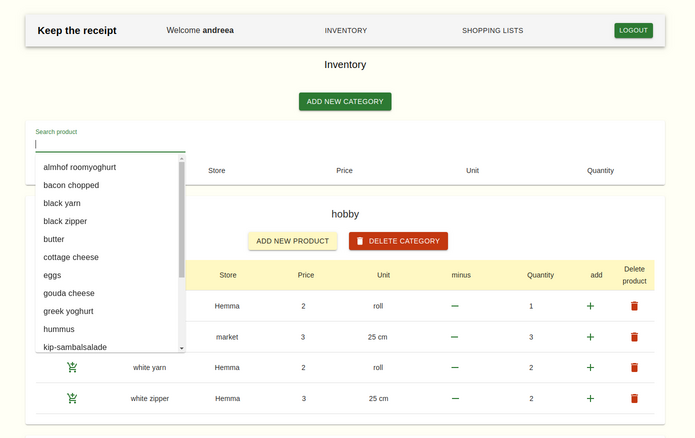
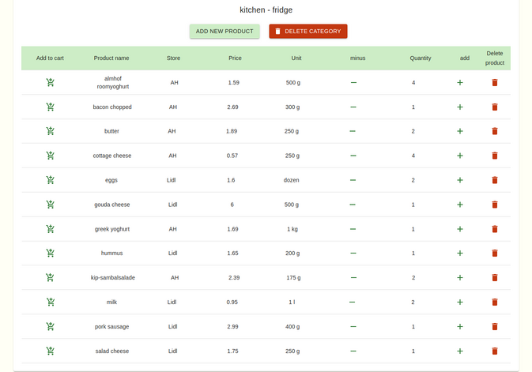

<h3 align="left">🧾 Keep the receipt - an app to help you keep track of your stuff 🧾</h3>

<h3 align="left">About the app</h3>

Keep the receipt app offers an easy way to always keep track of the stuff you already have so you don't buy what you don't need. Users can optimize their expenses by taking advantage of the built in shopping list functionality. On top of this users can now easily organize their storage spaces by using the inventory management feature.

Never run out of ingredients for your tasty homemade pizza.
All you need to do is to... <strong>Keep the receipt.</strong>

<a href="https://keep-the-receipt.netlify.app/">Here you find a working version</a>

<h3>App demo</h3>

<h3 align="left">Used technologies</h3>

<ul>
<li>React</li>
<li>Redux</li>
<li>NodeJS</li>
<li>Express</li>
<li>REST APIs</li>
<li>Sequelize ORM</li>
<li>Material-UI</li>
</ul>

<h3 align="left">Goals for this project</h3>

<ul>
<li>practice full-stack app development</li>
<li>build a working prototype in 2 weeks</li>
<li>apply what we learned in Codaisseur's bootcamp</li>
<li>extend with new technology independently</li>
<li>practice appropiate version control</li>
<li>setup a project layout by means of wireframes, database models and project boards</li>
</ul>

<h3 align="left">User Stories</h3>

<ul>
<li>As a page visitor, I can sign up and log in as a user.</li>
<li>As a user, I can see all my categories with all my products in my inventory.</li>
<li>As a user, I can create and delete categories for my inventory.</li>
<li>As a user, I can add or delete products to each category.</li>
<li>As a user, I can search for a product from all categories.</li>
<li>As a user, I can modify the quantity of each product.</li>
<li>As a user, I can add every product to a shopping list.</li>
<li>As a user, I have a shopping list with all added products.</li>
<li>As a user, I can sort the products in my shopping list by the store I can buy them from.</li>
</ul>

<h3 align="left">Project Board</h3>

Go to <a href="https://github.com/users/AndreeaMatei2811/projects/1">project board</a>

<h3 align="left">Wireframe</h3>

Go to <a href="https://wireframepro.mockflow.com/editor.jsp?editor=off&perm=Owner&projectid=M03515d0bc68d46d7254bff1590fba3061605887884080&publicid=f1c2cf986987475791e59008e8cbc269#/page/9180e9b663ae4374ae0f4a1372e8a99a"> wireframe</a>

<h3 align="left">Datamodel</h3>

Go to <a href="https://dbdiagram.io/d/5fbb620d3a78976d7b7cfe84">datamodel</a>

<h3 align="left">Backend server repo</h3>

Go to <a href="https://github.com/AndreeaMatei2811/Keep-the-receipt-Server">the backend repository</a>

